# Portfolio Documentation

## Link (URL) my published portfolio website

[Portfolio on Netlify](https://samaakanani.netlify.com)

## Link to my GitHub repository
[Portfolio on GitHub](https://github.com/DevSamaa/Portfolio)

* The GitHub repository is public and can be viewed by anyone. If you do however run into any problems, please notify me.

## Description of my portfolio website
1. Purpose
2. Functionality / features
3. Sitemap
4. Screenshots
5. Target audience
6. Tech stack 
<br>
<br>

### 1.Purpose
The purpose of this portfolio was to create a professional website that demonstrates my current coding capabilities. The creation of this portfolio has given me the opportunity to practise what I have learned in class and improve my html and css skills. Prior to completing this portfolio I was struggling to understand how the flex-direction in flexboxes change and how media queries are utilized. After completing the website I feel much more confident in this regard.
The website that I built has a minimalistic and flat design, which is in line with my personal style.
It contains five separate pages: home, projects, resume, blog, and contact. The next section is going to focus on what each one of these pages does.
<br>
<br>

### 2.Functionality / features
I have created wireframes of each one of the website pages. Due to the fact that we needed to provide an annotated version of the wireframes, I have included screenshots with the comments in this section. However, if you’d like to see the original Figma document you can do so here:
[Wireframes on Figma](https://www.figma.com/file/xO8psNB8MnbIhMaN8y98p3/Portfolio-with-comments?node-id=0%3A1)

<br>
The website is made up of several parts. A background and a container. Inside the container there is a navigational bar, a main part and a footer.
The basic structure of the website remains constant through all the pages. The only thing that changes is the middle (main) part which is a div with the class of “main”.

````
<div class="main"></div>
````
<br>
This is the home page. It's the first page that a user sees when they visit my website. The page contains a photo, a title, and a body text.

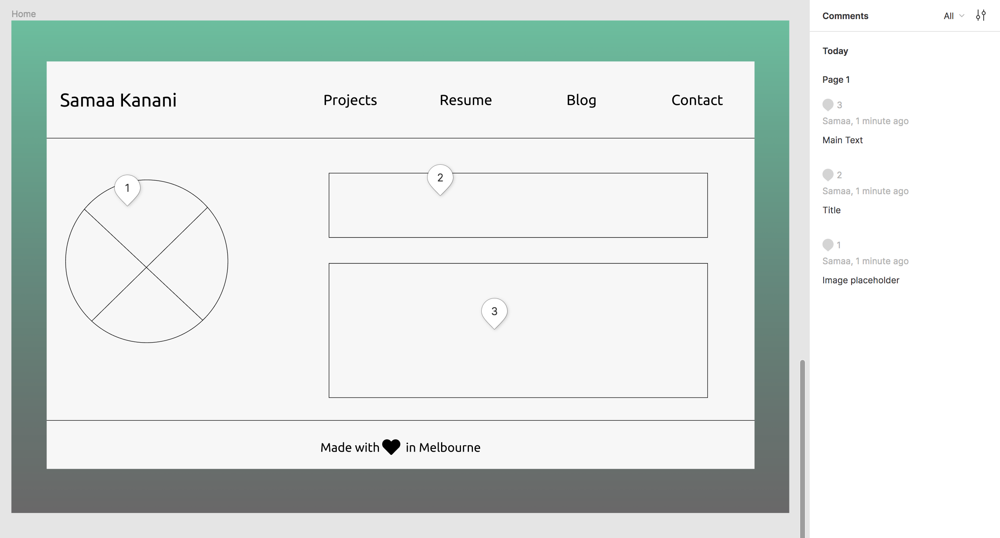

This page is dedicated to the projects which I have completed during the bootcamp. The users will be able to see a screenshot of the project, the title of the project, a description of the project, as well as a link to the right GitHub repository.
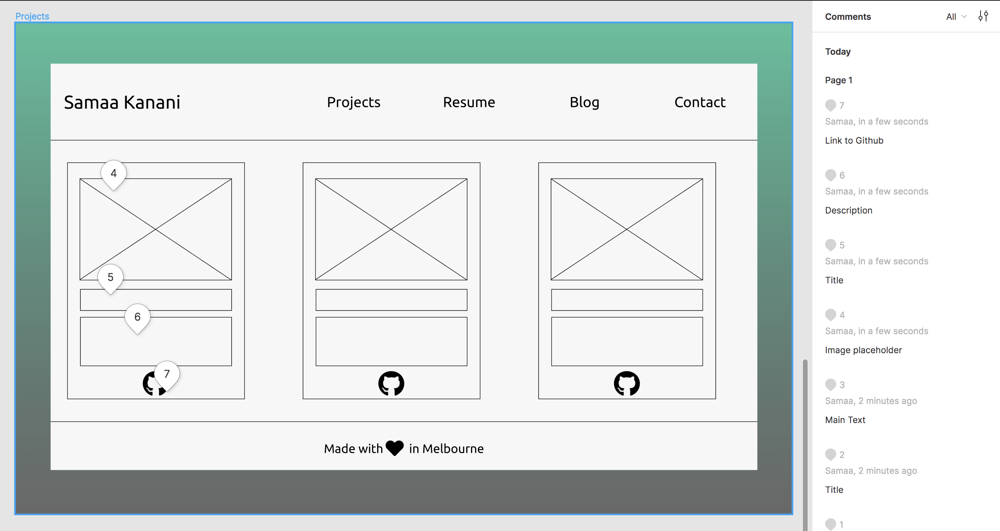


The resume page contains a link to my LinkedIn profile as well as a downloadable PDF version of my resume.
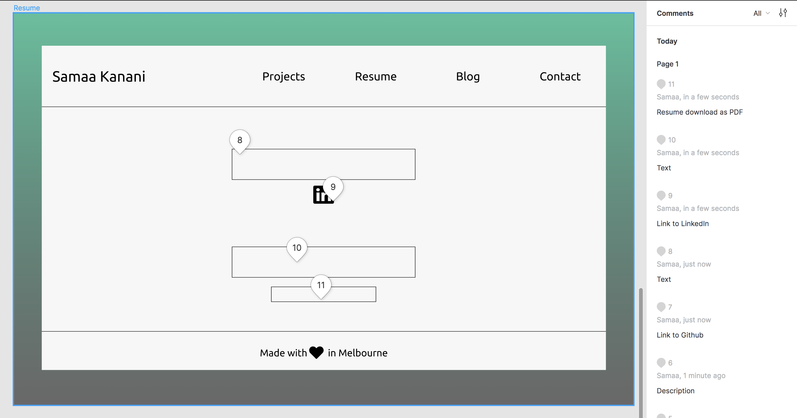

The Blog page contains a frame for the blog posts. They can be scrolled vertically. Each post can have an image, a title, a date, and the main text.
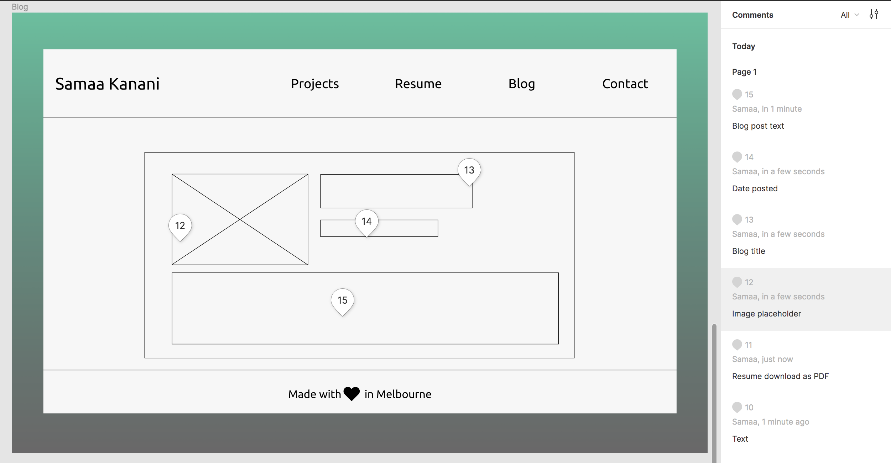

This is the contact page. It contains a contact form with a field for the users name, email address, and question. There is a submit button at the bottom.
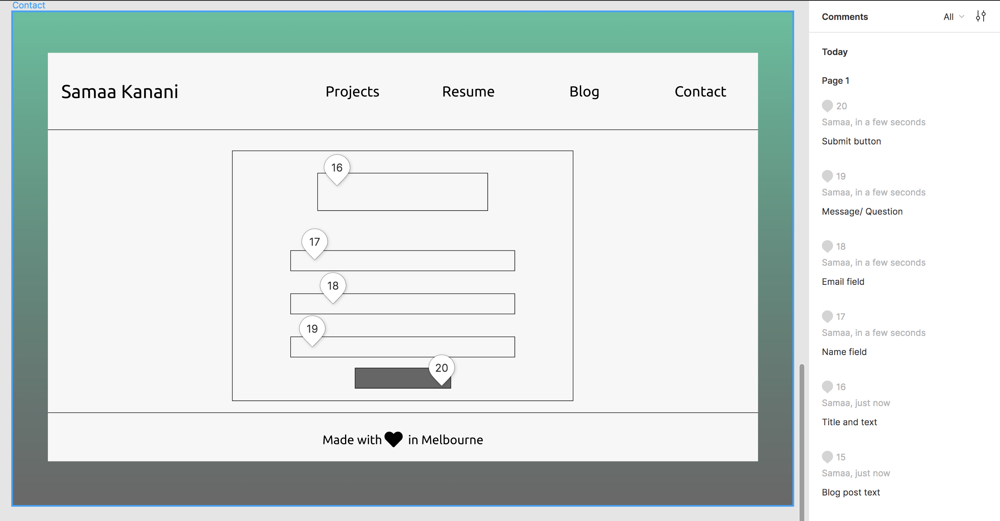

<br>
<br>

### 3. Sitemap
This is the sitemap of my portfolio. <br>
As you can see there is a home page and four more pages with content. Any one of the pages can be accessed from anywhere on the website through the navigation bar.
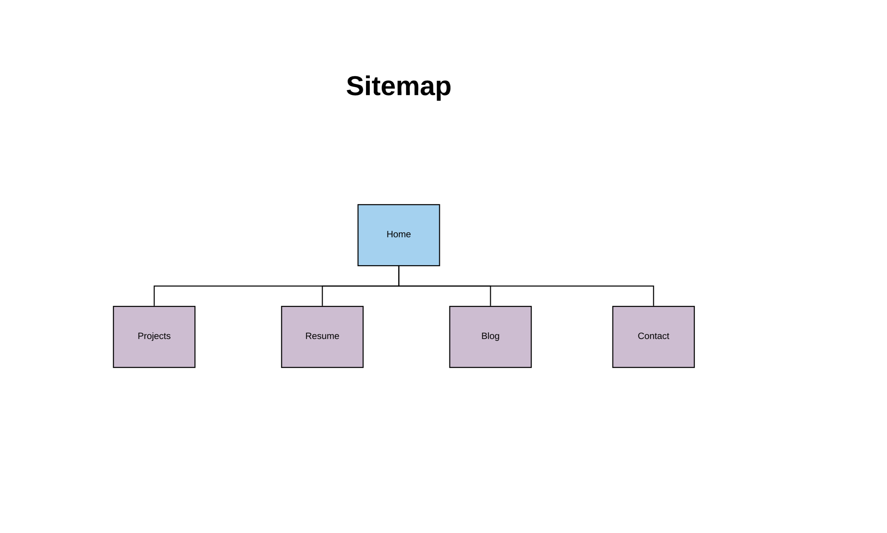
<br>
<br>

### 4.Screenshots

Before I started mocking up my website, I searched for inspiration on Dribbble. You can view the full
[mood board on Dribbble](https://dribbble.com/DevSamaa/buckets/1523070-Portfolio-Inspiration)
<br>
This image below is part of the mood board.
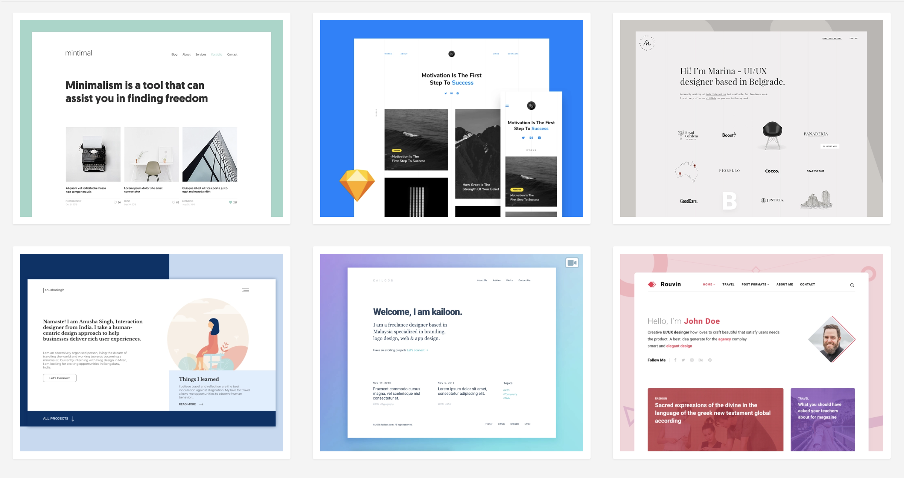

Once I collected more than 20 designs on my mood board I started working on my color palette. You can see the color palette 
[here](https://coolors.co/4bc19c-3a3839-7c5371-1e1d1e-f7f7f7)

Or take a look at this screenshot of the color palette here:
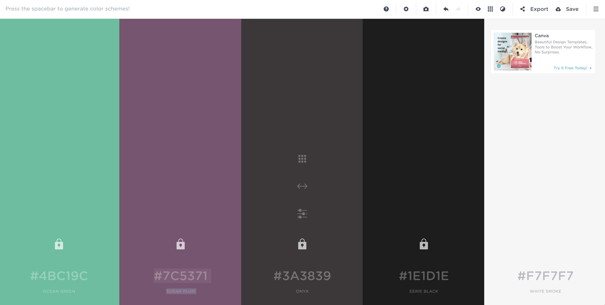

I also found one concrete example of a contact form that I wanted to implement on my website. This is what it looks like:
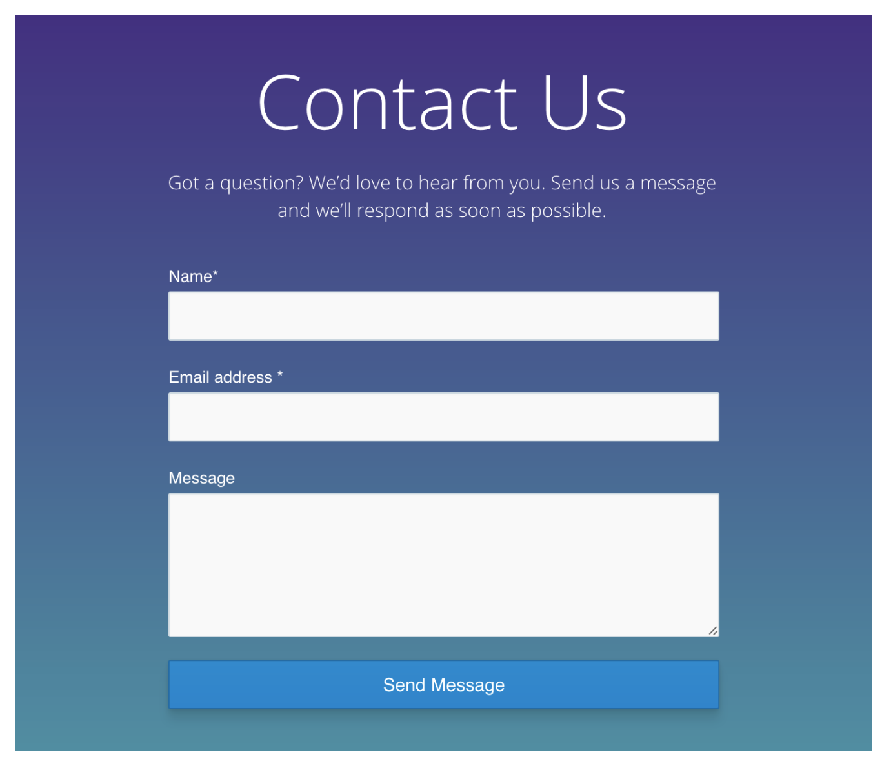

<br>
Once I had my color palette and some inspiration I started sketching my design ideas on paper:

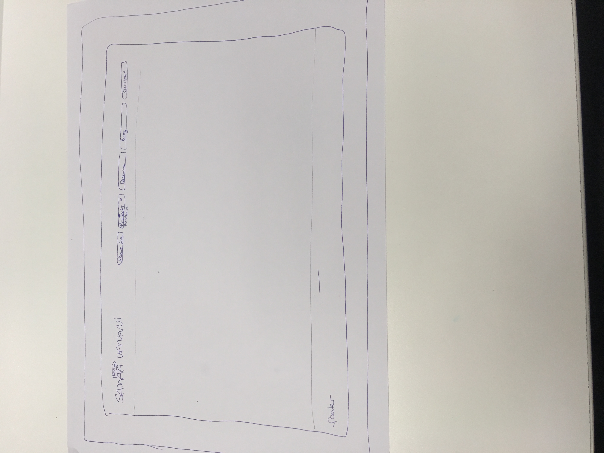
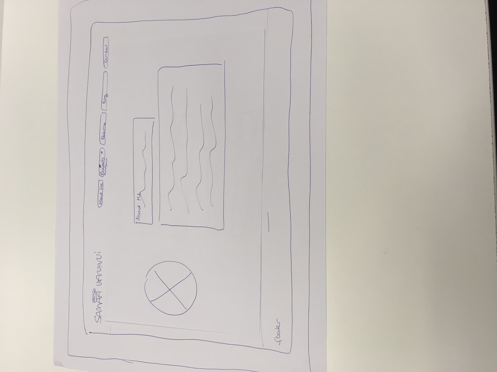
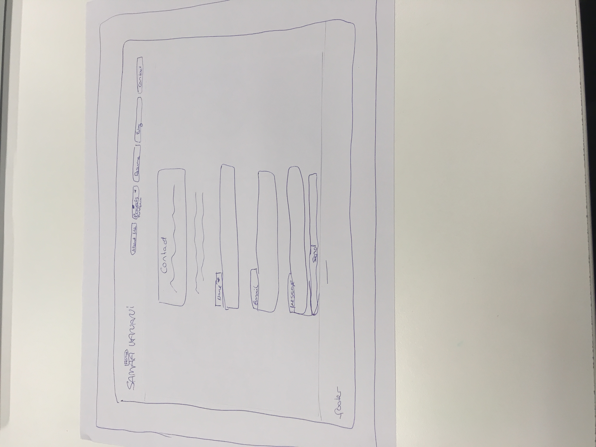
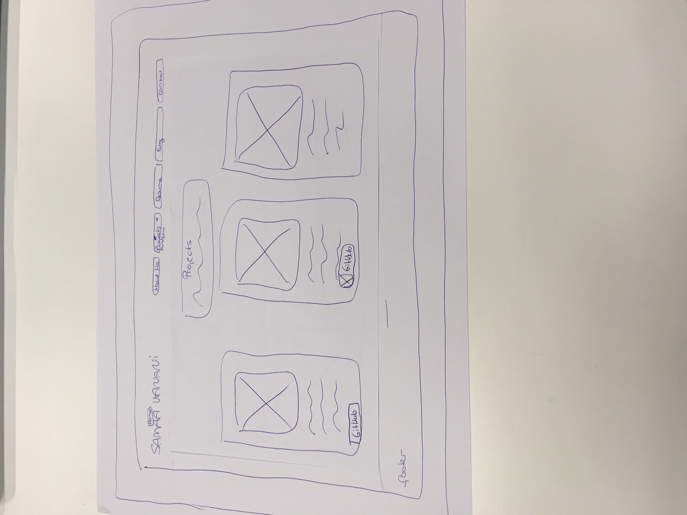
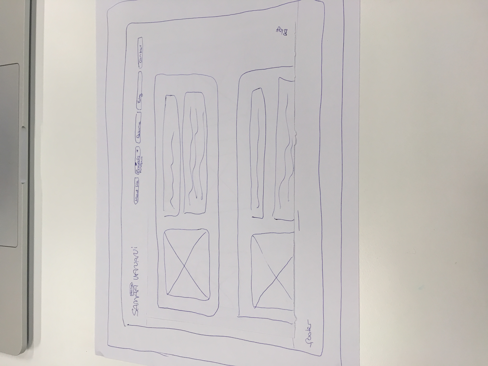

### 5.Target audience
In theory, the target audience of this portfolio could be anyone who has access to the internet and an interest in viewing my portfolio. The actual target audience of this website however is comprised of potential future employers, external recruiters, or fellow developers will look at this website. It is designed in a way that should make it obvious to most of the target audience what the website is about and what they can do there.
However, the website comes with its own limitations making it hard or impossible for some people to access. The copy is entirely in English, which means that anyone who cannot speak English would be unable to understand the website. 
<br>
<br>

### 6.Tech stack
* The website is built with regular HTML and CSS only. I did not use any frameworks. In order to make the website responsive, I made use of flexboxes and media queries. I also tried to use percentages rather than pixels for width and height whenever it was possible.
* The website has three branches: master, non-responsive and font-change. The main branch is he master branch. This is also the code that is fully responsive. The non-responsive branch contains my MVP which is not fully responsive (although it does make use of flexbox so it is somewhat responsive). The font-change branch code is also not fully responsive but it does have a different font and background color.
* All three branches of the code can be found on GitHub.
* The website was deployed through netlify, which is connected to GitHuh.